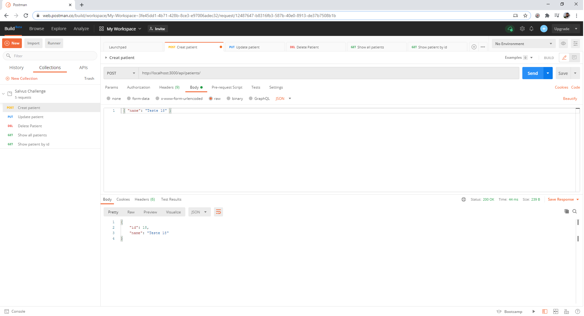
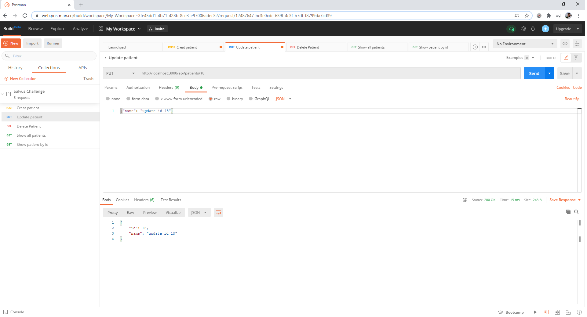
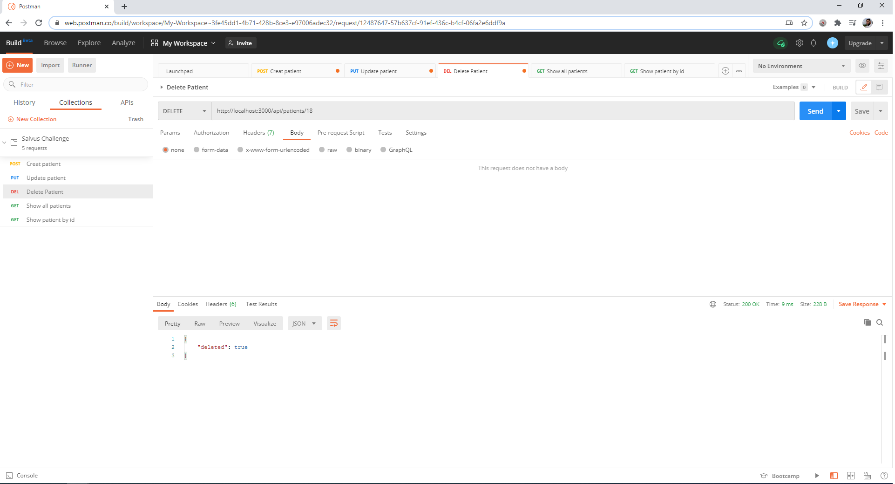
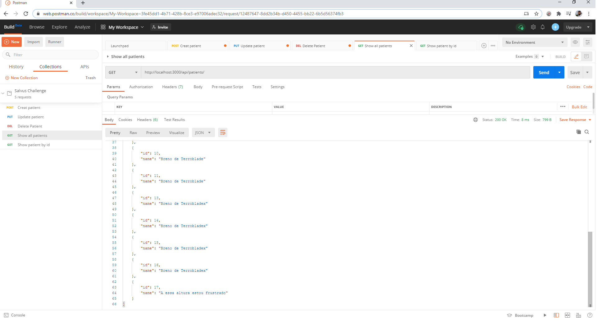
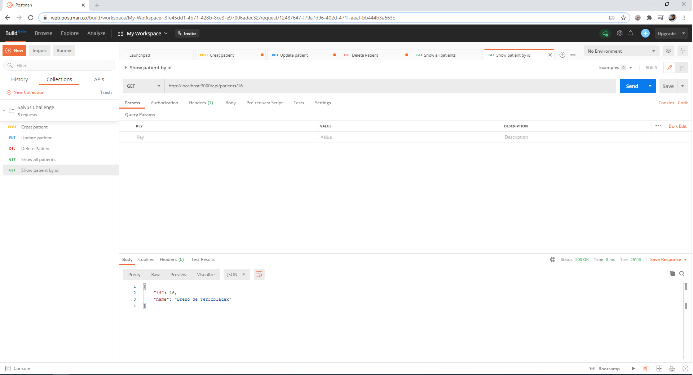

# salvus-challenge
Estou testanto pull request...tava me enrolando!
## Teste Técnico para a Vaga de estágio em desenvolvimento
O teste requisitou a implementação de uma aplicação capaz de criar, atualizar, excluir e ler (CRUD) dados de uma determinada entidade.
Frisando a importância de um serviço de rotas seguindo o princípio de uma arquitetura REST. Conforme o exemplo:

GET /api/patients

GET /api/patients/:id

POST /api/patients

PUT /api/patients/:id

DELETE /api/patients/:id

Por recomendações utilizei o framework Express.js, o query builder Knex  e o banco de dados escolhido foi o Postgres.

Passo-a-passo 
--------------------------------------------------------------------------------------------------------------------------------------------
Baixe este repositório e instale-o utilizando  o comando:
```
npm install
```

Para iniciar o projeto use o comando:

```
npm start
```


A consulta geral com todos os dados de todos pacientes pode ser efetuada atráves do http://localhost:3000/api/patients.
Dados de um paciente específico são obtidos através do id dele, por exemplo http://localhost:3000/api/patients/2


Para testar as outras funções de Create (POST), Update(PUT), Delete(DELETE), a ferramenta utilizada foi o POSTMAN:

## CREATE



## UPDATE



## DELETE



## SHOW(ALL)



## SHOW(ID)



